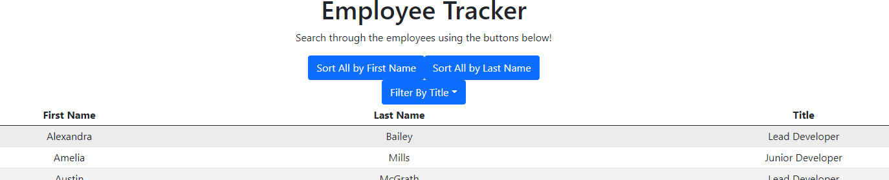

# [React Employee Directory](https://alexander-camacho.github.io/reactEmployeeDir/)

## Description
As a user, I want to be able to view my entire employee directory at once so that I have quick access to their information.

## Table of Contents       
- [Usage](#usage)           
- [Questions?](#questions)    
## Usage
This project is deployed live on Github-pages at the link [here!](https://alexander-camacho.github.io/reactEmployeeDir/)

When the page is loaded the viewer will be presented with a list of employees as well as their job titles. The user will then have a set of buttons that will allow them to interact with the data in different ways.

The options are below:

- Sort All by First Name - Sorts the employees alphabetically by First Name
- Sort All by Last Name - Sorts the employees alphabetically by Last Name
- Filter by Title - Displays a dropdown menu with an option for each job title, that allows the user to filter the employees by a specific job title.

## Questions?

View more of my work at the Github link below or contact me at the email below.

Github: [alexander-camacho](https://github.com/alexander-camacho)

Email: alsbrain@optonline.net
